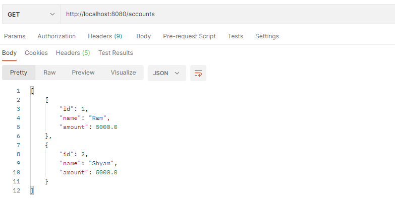
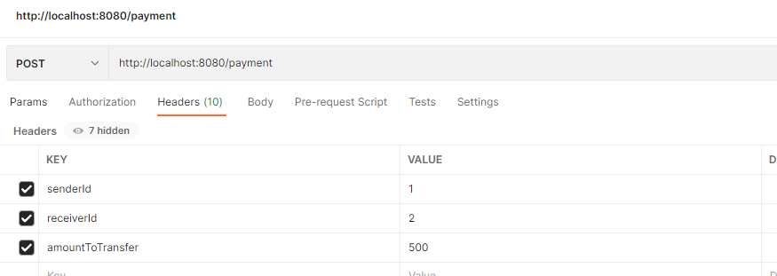
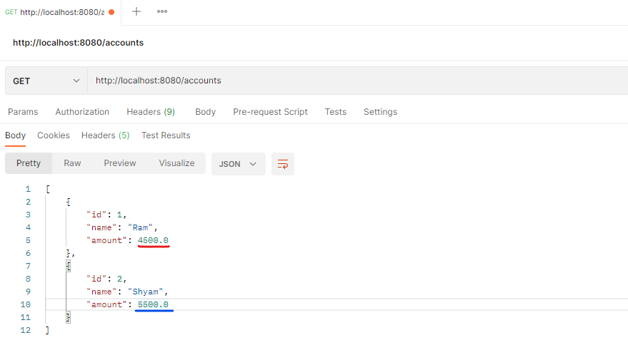
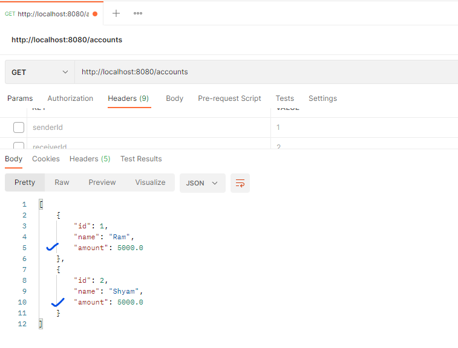

# Spring Transactions

In this project we see the Spring's support for Transactions. Whenever we need our data to be consistently
to be stored in our database, then we can make use of **Transactions**, is a set of collection of various operations
that it executes all of them or none of them at all. Consider as a block of statements,
and it will execute them one by one, but if one of the operations fails then it will **RollBack** the data to the original
state that it was while starting the transaction, or if all the operations execute successfully then it will **Commit**
or save the new data to our database.

When it comes to using it in Spring, it is easy we just need to annotate the method which is going to perform the 
transaction operations with _@Transactional_ annotation, so it will treat the method as a transaction block.
Behind the scenes Spring configures an Aspect that will intercept the methods and if the method executes peacefully then
it commits the transaction and if a **Runtime-Exception** is _thrown_ then it will rollback the transaction.

Using the Spring-Data support for creating and managing the Repositories and providing their implementations, In 
this case using the CrudRepository.

    But the important thing to note is that Runtime exception needs to be thrown by the method or else
    it will not be visible by the aspect outside and it will still commit the operation.
    if the method handles the exeception using try catch block then it will be catched by method, but 
    aspect will have no knowledge of it and transaction commits.

In this example we have an Account database which stores basic details like name and amount of a user, We are 
then performing the transfer money operation via transactions and to persist the data and other operations like update
using Spring-Data-JDBC support, and finally expose the Controller methods to perform operations.

The data.sql file will add two records to our table with Ram and Shyam both having Rs. 5000 balance each.

Next We try to transfer amount of Rs. 500 from Ram's account to Shyam.

Now let's check the balance of both again

It was success, but what if after the transfer if something fails, I will un-comment the exeception at last and then let's
see:
it will give an Internal Error of 500 and in app console we see Exception "Transaction Fails"
and if we again query the endpoint then we can see that amount has not changed in both the accounts

To run the app: Use the command _mvn spring-boot:run_ or you can also use _.mvn wrapper_ which is provided.
                    

